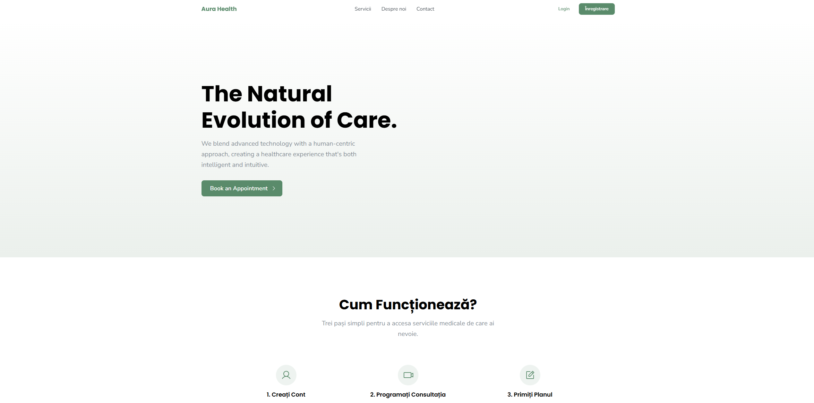

# ✨ Aura Health - Frontend

A modern telemedicine platform designed to provide an accessible and intelligent healthcare experience, blending cutting-edge technology with a human-centric approach.




---

## 🚀 Key Features

* **Virtual Consultations:** Secure video connections with medical specialists.
* **AI-Powered Diagnostics:** A tool for preliminary symptom analysis.
* **Personalized Health Monitoring:** Track health data and receive personalized insights.
* **Medical Records Management:** Secure and centralized access to medical history.
* **Secure Authentication:** Login and registration system powered by Laravel Sanctum.

---

## 🛠️ Tech Stack

### Frontend
* **Framework:** [React](https://react.dev/) 18.3
* **Language:** [TypeScript](https://www.typescriptlang.org/)
* **Build Tool:** [Vite](https://vitejs.dev/)
* **UI Library:** [Mantine UI](https://mantine.dev/)
* **Server State Management:** [TanStack Query (React Query)](https://tanstack.com/query/latest)
* **Forms:** [React Hook Form](https://react-hook-form.com/)
* **Routing:** [React Router](https://reactrouter.com/)
* **HTTP Client:** [Axios](https://axios-http.com/)

### Backend
* **Framework:** [Laravel](https://laravel.com/) (connected via API)

---

## ⚙️ Getting Started

Follow these steps to get a local copy of the project up and running.

### Prerequisites
* [Node.js](https://nodejs.org/en) (version 18 or newer)
* [Git](https://git-scm.com/)
* A running instance of the backend server (Laravel) that is accessible.

### Installation

1.  **Clone the repository:**
    ```bash
    git clone https://github.com/AdrianRazvanRadulescu/aura-health-frontend.git
    ```

2.  **Navigate into the project directory:**
    ```bash
    cd aura-health-frontend
    ```

3.  **Install dependencies:**
    ```bash
    npm install
    ```

4.  **Set up environment variables:**
    Create a `.env` file in the project root by copying the `.env.example` file or creating it from scratch. Add the URL of your backend API:
    ```
    VITE_API_BASE_URL=http://localhost:8000/api
    ```

5.  **Start the development server:**
    ```bash
    npm run dev
    ```

The application should now be available in your browser at `http://localhost:5173`.

---

## 📜 Available Scripts

* `npm run dev`: Runs the app in development mode with hot-reloading.
* `npm run build`: Builds and optimizes the app for production in the `dist/` folder.
* `npm run lint`: Runs ESLint to check for code and style errors.
* `npm run preview`: Starts a local server to preview the production build.

---

## 📄 License

This project is distributed under the MIT License. See `LICENSE` for more information.

---
## 👨‍💻 Contact

Adrian-Razvan Radulescu - [adrianradulescu998@gmail.com](mailto:adrianradulescu998@gmail.com)

Project Link: [https://github.com/AdrianRazvanRadulescu/aura-health-frontend](https://github.com/AdrianRazvanRadulescu/aura-health-frontend)